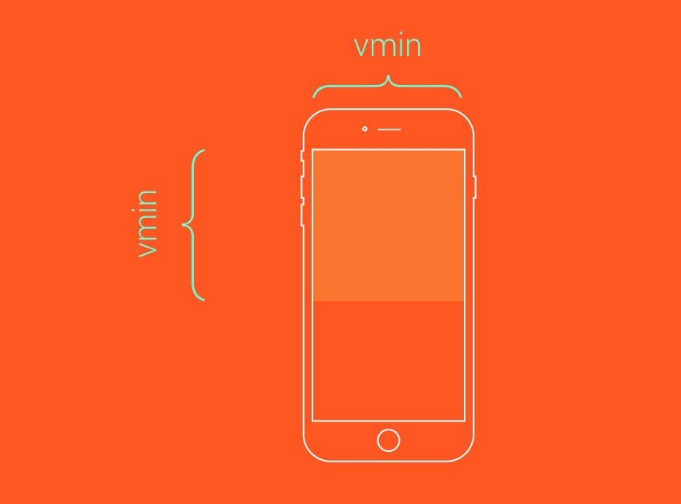
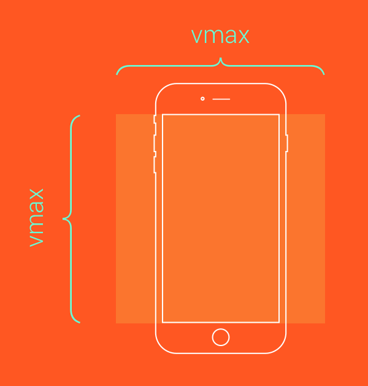

# 폰트 단위

| 단위 |                  설명                   |   기준점  |
|:----:|:--------------------------------------:|:---------:|
|  *em |         엘리먼트의 폰트 사이즈           | 글자 크기 |
|  ex  |   엘리먼트의 폰트의 x(소문자) 높이 값     | 글자 크기 |
|  ch  | 엘리먼트 폰트의 0(숫자)glyphs의 가로값    | 글자 크기 |
| *rem |       루트 엘리먼트의 폰트 사이즈         | 글자 크기 |
|  vw  |            뷰포트 너비의 1%              | 화면 크기 |
|  vh  |            뷰포트 높이의 1%              |           |
| vmin |       뷰포트의 중 작은 크기의 1%          |           |
| vmax |        뷰포트의 중 큰 크기의 1%           |           |


## :one: px
- 절대값
## :two: em
- 해당 태그가 상속받고 있는 크기에 비례하는 상대적인 길이

```
<div class="a">
  <p>내 사이즈는?</p>
</a>
```

```css
.a {font-size: 12px}
p {font-size: 1.2em; padding: 1em;}
```
- p는 font-size는 .a에서 폰트값을 상속 받고 있으니 12*1.2 = 14.4px;
- p의 padding은 p의 14.4px에서 상속 받고 있으니 14*1=14.4px;

## :three: rem(root em)
- 최상위 요소인 html요소에 비례하여 크기를 가지는 상대적인 길이
- html에 별도 사이즈 지정이 없으면 기본 시스템 사이즈 {font-size: 16px;} 로 정의 (1rem = 16px;)

```
<div class="a">
  <p>내 사이즈는?</p>
</a>
```

```css
html {font-size: 14px}
.a {font-size: 10px}
p {font-size: 2.0rem; padding: 1rem;}
```
- p의 font-size는 14*1.2 = 16.8px;, p의 padding는 14*1.0 = 14px;

```note
폭이 유연하게 동작 하기 위해서 width를 대부분 %로 잡는데,
font-size외에 padding, margin등 font-size에 비례하는 것은 rem, em을 자주 쓴다.
*tip* `font-size는 rem 나머지 여백 요소는 em을 사용`
```

```
*{padding: 0; margin: 0;}
.box{
  display: inline-block;
  padding: .4em;/* padding: 64px; */
  padding을 4rem으로 잡으면 font-size의 변화에 상관없이 패딩값이 고정되어 있고
  em으로 잡을경우 폰트사이즈에 비례해서 여백이 조율된다.
  *폰트 사이즈를 기준으로 상대적으로 변하는 디자인일 경우 여백 요소는 em으로 잡는다.

  font-size: 10rem; /* font-size: 160px; */
  1. font-size는 rem으로 설정한다
  박스 안에서 정의되는 요소들의 기준점 -> 결국 1em이 되는 것이기에

  font-weight: 900;
  border: 1px solid green;
  box-sizing: border-box;
}
```

## :four: %
- 해당 태그가 상속받고 있는 크기에 비례하는 상대적인 길이 (em과 동일)

```tip
반응형 비율 계산 : https://dabin-lee.github.io/test_long/2_css/AWD_RWD.html
```

## :five: vw / vh
- (모바일 전용)
- verticah height, vertical width
- 뷰포트의 너비값과 높이값에 상대적인 영향을 받는다. ( 레아이웃, 폰트 단위 모두 가능)
-  장점은 보이시는 대로 항상 눈에 보이는 디스플레이의 일정 비율을 차지하도록 만들어지기 때문에 사용자가 화면의 크기를 임의로 줄였다 늘였다 해도, 콘텐츠가 화면의 일정 비율을 항상 차지하게 해서 예쁜 구조를 유지할 수 있다.
-  1vh는 실제 높이값의 1/100 즉 눈에 보이는 화면 높이가 1000px일 때 1vh는 10px이 된다.
<!-- -  데스크탑과 모바일에서 동시에 운영되는 사이트를 제작할 때 유용 -->
vw : 브라우저 너비값의 1/100 ( 가로 760px * 1vw = 7.6px )
vh : 브라우저 높이값의 1/100 ( 세로 600px * 1vh = 6px )

:six: vmin / vmax

- vmin : 웹브라우저 너비와 높이 중에 더 작은 값을 기준으로 하여 100분의 1 한 값.
- vmax : 웹브라우저 너비와 높이 중에 더 큰 값을 기준으로 하여 100분의 1한 값.

```
브라우저 너비가 960px , 높이가 1200px 이라면
1vmin = 9.6px(960/100) , 1vmax = 12px(1200/100) 이다.
```

```note
vh와 vw이 늘 뷰포트의 너비값과 높이값에 상대적인 영향을 받는다면
vmin과 vmax는 너비값과 높이값에따라 최대, 최소값을 지정할 수 있습니다.
예를 들면 브라우저의 크기가 1100px 너비, 그리고 700px 높이일때 1vmin은 7px이 되고 1vmax는 11px이 됩니다.
너비값이 다시 800px이 되고 높이값이 1080px이 되면 vmin은 8px이 되고 vmax는 10.8px이 됩니다.
```

```css
.box {
    height: 100vmin;
    width: 100vmin;
}
```


```css
.box {
    height: 100vmax;
    width: 100vmax;
}
```


