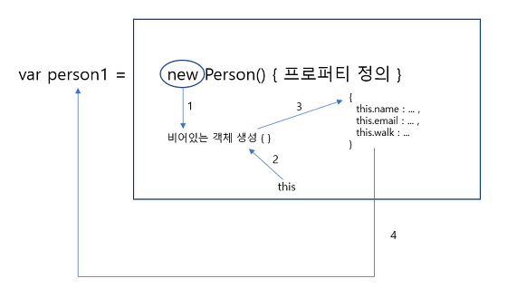
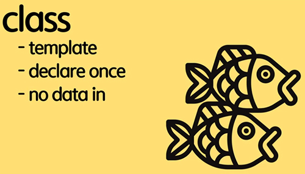
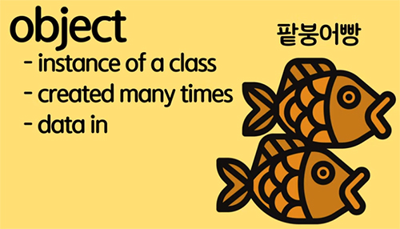
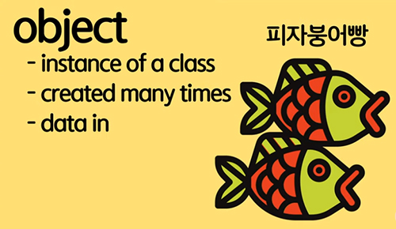

# 모르겠는건 더 자세히

## 1. Null check [빈 값 체크]
- [출처](https://sanghaklee.tistory.com/3?category=610728)
- js에서 어떤 값이 비어있는지 체크하기 위해서 null checking 방법을 사용한다.

```javascript
// 비추천
var value2 = ""
if( value2 == ""){
    console.log("비어 있음");
}else{
        console.log("값이 있음");
    }
```
▼ OR연산을 사용한 빈 값 체크
```javascript
var value2 = ""
if( !value2 ){
    console.log("비어 있음");
}else{
        console.log("값이 있음");
    }
```

*[if 조건식에 true로 반한되는 값이 없기에 else문 실행]*
```javascript
if('' || null || undefined || 0 || NaN){
   // ...
}else{
    console.log('그 외 여기서 실행');
}
```
- 하지만, 어떤 값이 들어올지 모르는 상황에서 빈값이 생기는 경우는 단순히 빈문자열( ' ' ), null 값, 정의되지 않은 값(undefined) 말고 `빈 배열( [] ), 빈 객체( {} )` 가 있을 수 있다.
- `그리고 중요한 0, 0은 실제로 비어있지 않은 특정값 0을 의미 할수도 있지만 이경우엔 false를 반환한다.`


*[어떤 값이 자료형에 상관없이 빈 값인지 알고 싶을 때]*
<script src="https://gist.github.com/dabin-lee/dccb27d5be34d693fdf032be2ca93d0d.js"></script>


## 2. 함수의 매개변수에 대하여


인수(Argument)와 인자(Parameter, 매개변수) 의 차이점

인자 : 함수를 사용할 때 넣어주는 값

```
function subtract(x, y){ //여기서 x, y는 파라미터
  return x - y;
}
const result = subtract(1, 2)//파라미터로 쓰여지는 값 : 인자
```


## 3. 해체 할당 (=비구조화 할당) (=구조분해 할당)

```note
왜 구조분해 할당이 생기게 됐나요?

객체와 배열은 js에서 가장 많이 쓰이는 자료구조입니다.
키를 가진 데이터 여러 개를 하나의 entity에 저장 할 땐 : object
컬렉션에 데이터를 순서대로 저장 할 땐 : array

개발을 하다 보면 함수에 객체나 배열을 전달해야 하는 경우가 생기곤 합니다.
가끔은 객체나 배열에 저장된 데이터 전체가 아닌 일부만 필요한 경우가 생기기도 하죠.

이럴 때 객체나 배열을 변수로 '분해’ 하는데
분해 할 수 있게 특별한 문법인 구조 분해 할당(destructuring assignment)사용할 수 있습니다.
```

[해체 할당 내용 출처](https://ko.javascript.info/destructuring-assignment)

### 배열 분해하기
[배열이 어떻게 변수가 될지?]
```javascript
// 이름과 성을 요소로 가진 배열
let arr = ["Bora", "Lee"]

// 구조 분해 할당을 이용해
// firstName엔 arr[0]을
// surname엔 arr[1]을 할당하였습니다.
let [firstName, surname] = arr;

alert(firstName); // Bora
alert(surname);  // Lee
```

[인덱스를 이용해서 배열에 접근이 아닌 배열메소드를 이용해서 사용 가능]
```javascript
let [firstname, surname] = "bora lee".split(" ");
console.log(firstname); //bora
console.log(surname); //lee
```

[배열 요소를 직접 변수에 할당하는 것보다 코드 양이 줄어든다.]
```javascript
let [firstName, surname] = arr;
let firstName = arr[0];
let surname = arr[1];
```


[쉼표를 사용하면 필요하지 않은 배열 요소를 버릴 수 있다.]
```javascript
// 두 번째 요소는 필요하지 않음
let [firstName, , title] = ["Julius", "Caesar", "Consul", "of the Roman Republic"];

alert( title ); // Consul;
//할당할 변수가 없기 때문에 네 번째 요소 역시 생략
```

[배열뿐만 아니라 모든 이터러블(iterable, 반복 가능한 객체)에 구조 분해 할당을 적용 할 수 있다.]
```javascript
let [a, b, c] = "abc"; // ["a", "b", "c"]
let [one, two, three] = new Set([1, 2, 3]);
```

[할당 연산자 좌측엔 ‘할당할 수 있는(assignables)’ 것이라면 어떤 것이든 올 수 있다.]
```javascript
// 객체 프로퍼티도 가능
let user = {};
[user.name, user.surname] = "Bora Lee".split(' ');

alert(user.name); // Bora
```

[두 변수에 저장된 값을 교환 할 때 구조 분해 할당을 사용한다.]
```javascript
let guest = "jane";
let admin = "pete";

[guest, admin] = [admin, guest];
// 변수 guest엔 Pete, 변수 admin엔 Jane이 저장되도록 값을 교환함

console.log(`${guest}, ${admin}`);
 // Pete Jane(값 교환이 성공적으로 이뤄졌습니다!)
```

[기본값 : 할당할 값이 없으면 undefined로 취급]
```javascript
let [firstName, surname] = [];

alert(firstName); // undefined
alert(surname); // undefined
```


### 객체 분해하기

- 우측 : 분해 하고자 하는 객체
- 좌측 : 상응하는 객체 프로퍼티의 `패턴`
- 분해하려는 객체 프로퍼티의 키 목록을 패턴으로 사용해보자
```javascript
let {var1, var2} = {var1:…, var2:…}
```

```
let option = {
  title: "menu",
  width: 100,
  height: 120
};

let { title, width, height } = option;

console.log(title);
console.log(width);
console.log(height);

혹은

let {height, width, title} ={ title: "Menu", height: 200, width : 100 }
```


## 4. 객체에 대하여

### 1. 객체 속성 이해하기
- 객체의 속성을 사용하려면 점표기법(.) 을 사용하고, 점 대신 ([])를 사용 할 수도 있다.
- 속성값은 문자열, 숫자, 객체 어떤 값이든지 상관없다.
- 속성값이 함수인 것은 메소드라고 특별히 따로 부른다.
- property는 key(문자열 또는 심볼)과 value(값)으로 구성된다.
- key는 항상 string 타입으로 받아와야 한다.
  - console.log(obj[key]) => function(ellie, 'name');
  - console.log(['ellie']);

[객체 프로퍼티 참조 - 데이터에 접근]
```
1. 객체이름.프로퍼티이름
2. 객체이름["프로퍼티이름"]

zero.firstName; // 'Zero'
zero['firstName']; // 'Zero' (이렇게도 가능합니다)
zero.lastName; // 'Cho'
zero['lastName']; // 'Cho'
```

[어떤 상황에 써야하는지?]
1. 점표기법(.) : 코딩 중 바로 실행 값을 받아오고 싶을 때
2. 꺾쇠괄호([]) : 동적사용시 유용함, key에 관련된 value를 받아 올 때


### 2. 객체 생성 방법
[출처: victolee블로그](https://victorydntmd.tistory.com/51)

> #### 1) 리터럴 객체
> - 가장 일반적인 방법 {}(중괄호)를 사용하여 객체를 생성
> - 프로퍼티의 값으로는 함수가 올 수도 있고, 배열, 객체 등 자유롭게 올 수 있다.
> - 객체 리터럴 안에 어떠한 프로퍼티도 작성하지 않으면 빈 객체가 생성된다.
> - 변수에 대입된 객체 안의 프로퍼티 값을 읽거나 쓸 때는 마침표(.) 또는 대괄호([])를 사용
> ```javascript
> card.suit // 하트
> card["rank"] // a
> ```
>
> ```javascript
> var person = {
>     name: "victolee",
>     email: "asdf@example.com",
>     birth: "0225"
> }
> - person은 name, email, birth 프로퍼티를 갖는 객체
> ```


> #### 2) Object() 생성자 함수
> - new 키워드를 이용하여 Object 생성자 함수를 호출하면 비어있는 객체를 얻을 수 있다.
> - new Object()를 호출하면 비어있는 객체를 생성
> - 객체 생성직후 person 객체에는 name, email, birth 프로퍼티를 갖고 있지 않으므로, new Object()로 비어있는 객체를 생성했으면 프로퍼티를 추가한다.
>
> ```javascript
> var person = new Object();
> console.log(person.name)
> console.log(person.email)
> console.log(person.birth)
>
> person.name = "victolee";
> person.email = "asdf@example.com";
> person.birth = "0225";
> console.log(person.name)
> console.log(person.email)
> console.log(person.birth)
> ```

> ```tip
> new 연산자로 호출 된 해당 함수는 생성자 함수로 동작한다.
> 함수가 일반적인 함수인지 객체를 만들기 위한 목적의 생성자 함수인지 구분하기 위해, 생성자 함수의 첫 문자는 대문자로 표기하는 것이 관례
> ```
> - new 키워드를 이용하여 Object 생성자 함수를 호출하면 비어있는 객체를 얻을 수 있다.
> - 함수명은 보통 대문자로 시작한다.
> - 함수 내부적으로 새로운 오브젝트가 생성되고 this로(생략) 표기된다. this에 property를 추가하는 형태
>
> ```javascript
> function Person(name,email){
>     this.name = name;
>     this.email = email;
>     this.walk = "직립 보행"
> }
>
> var person1 = new Person("victolee", "foo@example.com");
> var person2 = new Person("worrr", "goo@example.com");
>
> console.log(person1.name + " " + person1.email + " " + person1.walk);
> console.log(person2.name + " " + person2.email + " " + person2.walk);
> ```
> - 생성자 함수에서 정의한 this는 생성자 함수로 생성된 인스턴스가 된다.




#### 4) 리터럴객체와 생성자함수 비교
- `new Object ()`와 객체 리터럴 표기법의 차이점

```javascript
var foo = {
    name: 'foo',
    age: 35,
    gender: 'man'
};
console.dir(foo);

function Person(name, age, gender, position){
    this.name = name;
    this.age = age;
    this.gender = gender;
}

var bar = new Person('bar', 33, 'woman');
console.dir(bar);

var baz = new Person('baz', 25, 'woman');
console.dir(baz);
```

1. 포로토타입 객체(proto property)의 차이점을 갖고 있다.
    - 객체 리터럴 방식의 경우는 자신의 프로토타입 객체가 object이다.
    - 생성자 함수의 경우는 new Person 로서 다르다.
2. js의 객체 생성 규칙 :  자바스크립트 객체는 자신을 생성한 생성자 함수의 prototype 프로퍼티가 가리키는 객체를 자신의 프로토타입 객체로 설정한다.
    - 객체 리터럴 방식에서는 객체 생성자 함수는 Object() 이고,
    - 생성자 함수 방식의 경우는 생성자 함수 자체이다.


### 3. 객체를 쓰는 이유
> > ```
> > //인자가 늘어날 경우 복잡해지고, 로지컬하게 그룹으로 묶을 수 없다.
> > const name = "ellie";
> > const age = 4;
> >
> > print(name, age) //name, age를 출력하고 싶다면 파라미터로 넣어준다.
> > function print(name, age){ //
> >   console.log(name);
> >   console.log(age);
> > }
> >
> > ```

> ▼ 개선하기 위해서 object를 쓴다.
> > ```
> > function print(person){ //
> >   console.log(person.name);
> >   console.log(person.age);
> > }
> >
> > const ellie = {name : 'ellie', age: 4};
> > print(ellie); //전달할때도 편하게 사용 할 수 있다.
> > ```


### 4. 프로퍼티 나열

[object.keys]
- 객체의 프로퍼티 키를 배열로 가져와야 할 때는 Object.keys가 편리 하다.
- 객체에서 나열 가능한 문자열 프로퍼티를 배열로 반환한다.

```
const SYM = Symbol();
const o = {a: 1, b: 2, c: 3, [SYM]: 4};
Object.keys(o).forEach(prop => console.log(``))
```

### 5. 객체의 key 와 value 값이 같다면
- property shorthand(단축 속성명)
- key 와 value 값을 각각 표기하지 않고 한 번만 표기하는 것을 의미합니다.

```
var a = "foo",
    b = 42,
    c = {};

var o = {
  a: a,
  b: b,
  c: c
};

// 단축 속성명 (ES6)
var o = { a, b, c };
```

## 5. 객체 지향 프로그래밍 이론
[OOP 이론 내용 출처](https://velog.io/@hkoo9329/OOPObject-Oriented-Programming-%EA%B0%9D%EC%B2%B4-%EC%A7%80%ED%96%A5-%ED%94%84%EB%A1%9C%EA%B7%B8%EB%9E%98%EB%B0%8D-%EC%9D%B4%EB%9E%80#oop%EC%9D%98-%ED%8A%B9%EC%A7%95)
```
`O`bject `O`riented `P`rogramming
객체의 관점에서 프로그래밍을 한다는 것
```
- OOP는 객체를 기준으로 코드를 나누어 구현한다.
- 클래스는 설계도, 직접 일을 구현하는 구현체는 인스턴스
- 애플리케이션을 구성하는 요소들을 객체로 바라보고, 객체들을 유기적으로 연결하여 프로그래밍 하는 것을 말한다.

### OOP 특징
#### 캡슐화 (Encapsulation)
> - 하나의 객체가 특정한 목적을 위해 필요한 변수나 메소드를 하나로 묶는 것을 의미한다.
> - 클래스를 만들 때 객체가 특정한 목적을 잘 수행 할 수 있도록 사용할 변수와 그 변수의 메서드 등을 서로 관련성 있게 클래스를 구성해야 한다.

 : **정보은닉**
  - 캡슐화를 하는 중요한 목적은 바로 정보은닉이다.
    ```
    유저 정보를 가지고 있는 User라는 객체에서 유저의 정보가 public으로 선언되어 있다면, 누구든 접근해서 유저 정보를 변경할 수 있다.

    그렇기 때문에 private로 해서 데이터를 보호해서 접근을 제한해야 한다.

    이렇게 보호된 변수는 getter나 setter 등의 메서드를 통해서만 간접적으로 접근이 가능하도록 하는 것이 캡슐화의 중요한 목적이다.
    ```
  - 캡슐화와 정보은닉은 동일한 개념이 아니다.
  - 캡슐화를 하면 불필요한 정보를 감출 수 있기 때문에, 정보은닉을 할 수 있다는 특징이 있다는 것이다.


#### 추상화 (Abstraction)
> - 목적과 관련이 없는 부분을 제거하여 필요한 부분만을 표현하기 위한 개념
> - 추상화는 객체들의 공통된 특징을 파악해 정의해 놓은 설계 기법
> - `객체들은 실제 그 모습이지만, 클래스는 객체들이 어떤 특징들이 있어야 한다고 정의하는 추상화된 개념`

  ```
  추상적으로 생각해 일단 큰틀의 클래스를 구현하고
  최소 공통적인 요소나 필수 적인 요소는 들어갔으면 하는 바램에서 만든 것이 추상클래스이다.

  예시)
  벤츠, 아우디, 티코 등등 우리가 생각하는 여러 종류의 자동차 -> 이것을 다 클래스화하고 변수와 메서드 등을 개별적으로 만드는 것은 무모한 짓
  자동차들의 공통적인 요소나 특징을 추출하는 과정인 추상화를 거쳐 요소를 끄집어 내면 바퀴, 핸들, 차문, 유리창 등 필수적인 부품이 있다.
  바퀴는 굴러가고, 핸들은 돌아가고 차문은 열려야한다 공통적인 행동 즉 어떤 차든 필수적으로 필요한 메서드가 추출된다.
  이렇게 추상적으로 끄집어 낸 개념들을 큰 틀에서 클래스로 만든것이 바로 추상클래스이다.
  ```

#### 다형성 (Polymorphism)
> - 상속을 통해 기능을 확장하거나 변경하는 것을 가능하게 해준다.
> - 형태가 같은데 다른 기능을 하는 것 - 코드의 재사용, 코드 길이 감소 등으로 활용도가 높다
> - `객체들은 실제 그 모습이지만, 클래스는 객체들이 어떤 특징들이 있어야 한다고 정의하는 추상화된 개념`

  ```
  예시)
  고양이 클래스에는 '울음'이라는 속성이 정의되어 있다.
  사자는 고양이 과이기 때문에 사자 클래스는 고양이 클래스를 상속 받는다고 하면, 사자 클래스에도 "울음"이라는 속성이 자동으로 추가된다.
  이것을 상속이라고 한다. 그런데 고양이와 사자의 울음소리는 다르다. (즉 같은 속성이지만 실제는 다름 => 다형성)
  ```


#### 상속성, 재사용(Inheritance)
> - 상속이란 기존 상위클래스에 근거하여 새롭게 클래스와 행위를 정의할 수 있게 도와주는 개념이다.
> - 기존 클래스에 기능을 가져와 재사용할 수 있으면서도 동시에 새롭게 만든 클래스에 새로운 기능을 추가할 수 있게 만들어 준다.
> - 상속이 필요한 이유:코드의 중복을 없애기 위함

  ```
  포유류라는 클래스는 고양이와 강아지 클래스에 속성들을 물려준다.
  이것을 상속이라고 하고, 포유류와 고양이 포유류와 강아지 클래스는 상속 관계에 있다고 한다.
  ```


## 6. class & object & instance
### 기본 지식

- 연관있는 데이터들을 한 곳에 묶어 놓는 컨테이너의 느낌이다.
- class = fileds + methods
```javascript
class person{
    name; //fields
    age; //fields
    speak(); //methods
}
```
- `이렇게 관련이 있는 변수나 함수들을 묶어 놓은 것을 **클래스** 라고 한다`
- class = 붕어빵틀
  - 클래스 자체에는 데이터가 들어있지 않고 템플릿만 정리해 놓는것
  - 지정한 데이터만 정의해놓고 데이터틀(class)은 한번만 선언한다.
- `이 클래스를 이용해 실제로 데이터를 넣어서 만든 것을 **오브젝트** 라고 한다`

  |     class     | object |
  |:-------------:|:------:|
  | 핸드폰 설계도 | 핸드폰 |
  | 자동차 설계도 | 자동차 |
  |   붕어빵 틀   | 붕어빵 |


- 클래스를 이용해서 새로운 인스턴스를 생성하면 오브젝트가 된다.
- 완성된 붕어빵 = object



- 팥 데이터 => 팥붕어빵 (object)
- 크림 데이터 -> 크림붕어빵 (object)
- 피자 데이터 -> 피자붕어빵 (object)

**[클래스, 객체, 인스턴스의 차이]**
```tip
object는 실체 / instance는 관계에 집중한 용어.
```

- 클래스(Class)
  - 객체를 만들어 내기 위한 설계도 혹은 틀
  - 연관되어 있는 변수와 메서드의 집합

- 객체(Object)
  - 소프트웨어 세계에 구현할 `대상`
  - 클래스에 선언된 모양 그대로 생성된 실체
  - ‘클래스의 인스턴스(instance)’ 라고도 부른다.

- `인스턴스(Instance)`
  ```tip
  일단, 인스턴스 또한 실체라서 인스턴스는 오브젝트가 맞습니다.
  그런데 인스턴스는 어떤 것으로부터 생성되었다는 의미에 집중합니다.
  ```
  - 생성된 복제본
  - 인스턴스는 어떤 원본으로부터 생성되었다는 의미가 내포된다.
  ```
  “제민은 지구상의 오브젝트다” (실체)
  “제민은 아버지의 인스턴스다” (복제-생성, 원본과의 관계)
  또한, 아래 용어도 성립합니다.
  “객체는 클래스의 인스턴스다” (객체는 클래스를 원본으로 생성한 복제본)
  나는 사람의 인스턴스다. (사람(원본)으로 부터 생성된 복제본의 의미)
  ```

[오브젝트와 인스턴스에 관한 글 읽어보기](https://www.ijemin.com/blog/%EC%98%A4%EB%B8%8C%EC%A0%9D%ED%8A%B8%EC%99%80-%EC%9D%B8%EC%8A%A4%ED%84%B4%EC%8A%A4%EC%9D%98-%EC%B0%A8%EC%9D%B4-difference-between-obect-and-instance/)
```
결국 인스턴스와 오브젝트 둘다 아래 의미를 내포합니다.

1. 실체다.
2. 무언가로부터 생성됬다. (관계)

하지만 오브젝트는 1, 인스턴스는 2에 무게가 실려있습니다. 그래서 이 두 문장에서 어색함을 느낀 것 입니다.

제민은 인스턴스다.
사람을 인스턴스화 한 것이 사람 오브젝트다. => 추상으로 부터 객체가 생성된 것에 의미를 두었음
```

```javascript
class Person{ //class
    constructor(name, age){ //생성자(constructor)를 이용해서
        this.name = name; // fields
        this.age = age; // fields
    }

    // methods
    speak(){
        console.log(`${this.name}: hello!`);
    }
}

const ellie = new Person('ellie', 20)
console.log(ellie.name);
console.log(ellie.age);
```

- 생성자(constructor)를 이용해서 object를 만들 때 필요한 데이터 전달
- 새로운 오브젝트를 만들때는 new라는 키워드를 쓴다.

## 5. js에 나오는 `this`
- 대부분의 경우 this의 값은 함수를 호출한 방법이 결정한다.
[!this](https://byseop.netlify.app/js-this/)
[!this](https://www.zerocho.com/category/JavaScript/post/5b0645cc7e3e36001bf676eb)


```javascript
this; //window{}
```
- this는 기본적으로 window이다.

- **[this가 window가 아닌경우]**
- 1. 객체의 메서드
  - 객체 메서드 a안에 this는 객체를 가리킨다.
  - 객체 메서드를 호출할 때 this를 내부적으로 바꿔주기 때문

```javascript
var obj = {
  a: function() { console.log(this); },
};
obj.a(); // obj
```

- 2. 단, 호출하는 함수가 객체의 메서드인지 그냥 함수인지가 중요
  - a2는 obj.a를 꺼내온 것이기 때문에 더 이상 obj의 메서드가 아니다.

```javascript
var a2 = obj.a;
a2(); // window
```

- 3. 명시적으로 this를 바꾸는 함수 메서드
  - `bind, call, apply`를 사용하면 this가 객체를 가리킨다.

```javascript
var obj2 = { c: 'd' };
function b() {
  console.log(this);
}
b(); // Window
b.bind(obj2).call(); // obj2
b.call(obj2); // obj2
b.apply(obj2); // obj2
```

- 4. 생성자 함수도 함수라는 것
  - `bind, call, apply`를 사용하면 this가 객체를 가리킨다.

```javascript
var obj2 = { c: 'd' };
function b() {
  console.log(this);
}
b(); // Window
b.bind(obj2).call(); // obj2
b.call(obj2); // obj2
b.apply(obj2); // obj2
```
### 일반함수와 화살표 함수에서 this
- 일반 함수는 자신이 종속된 객체를 this로 가리키며, 화살표 함수는 자신이 종속된 인스턴스를 가리킨다.

```javascript
function BlackDog() {
  this.name = '흰둥이';
  return {
    name: '검둥이',
    bark: function() {
      console.log(this.name + ': 멍멍!');
    }
  }
}

const blackDog = new Blackdog();
blackDog.bark(); // 검둥이: 멍멍!

function WhiteDog() {
  this.name = '흰둥이';
  return {
    name: '검둥이',
    bark: () => {
      console.log(this.name + ': 멍멍!');
    }
  }
}

const whiteDog = new Whitedog();
whiteDog.bark(); // 흰둥이: 멍멍!
```
#### 화살표 함수 this
- `화살표함수는 this를 정의하지 않습니다.`
- 함수의 내부함수, 콜백함수에 사용되는 this는 window입니다.
- 일반 함수와 화살표 함수의 차이점이 있습니다. 일반함수가 전역 컨텍스트에서 실행될 때 this가 정의합니다.


```javascript

// react
import React from 'react'

class BindTest extends React.Component {
  handleClick = () => {
    console.log(this)
  }
  render() {
    return (
      <button type="button" onClick={this.handleClick}>
        Goodbye bind
      </button>
    )
  }
}
export default BindTest
```
- 화살표 함수의 this 는 외부함수(부모함수)의 this 를 상속받기 때문에 this 는 항상 일정하다.
- 위 예제의 경우에는 BindTest 클래스(사실 함수입니다)가 되는 것이다.
[출처 : react arrow](https://blueshw.github.io/2017/07/01/arrow-function/)

## 6. null과 undefined

```javascript
let a;
console.log(a); //undefined
let b = null;
```
- Javascript 원시타입에는 null과 undefined가 존재한다. 이 둘의 차이점은?
  - undefined : 변수를 선언하였지만 `아직 값을 할당하지 않았음`을 의미한다.
  - null : 어떤 변수에 `아무런 값도 나타내지 않겠다 라는 의도`를 가지고 일부러 넣은 값을 의미한다.


```javascript
const fn = (arg = 'dp') => console.log(arg);
fn(); // dp
fn(undefined); // dp
fn(null); // null
```
- 만약 함수에서 default parameter가 지정이 되어있는데 인자로 undefined 또는 null을 넘겨준다면?
  - undefined를 인자로 주었을 땐 dp가 출력
  - null은 dp가 아닌 null이 그대로 출력
  - default parameter는 파라미터에 값이 없거나 undefined인 경우에 동작하기 때문에 null을 넘겨주면 null 값이 그대로 들어가게된다.

```danger
함수를 사용시 인자로 null이 들어갈 가능성이 있다면 default parameter가 동작하지 않을 수 있음을 주의
```