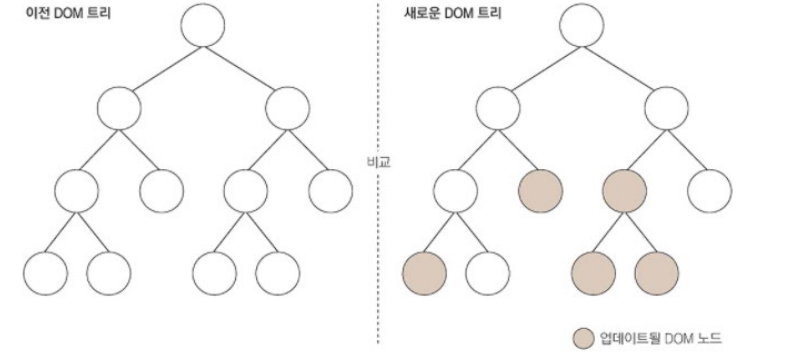
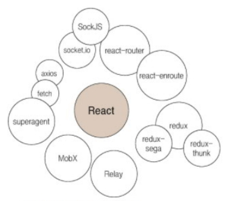
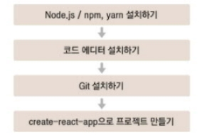
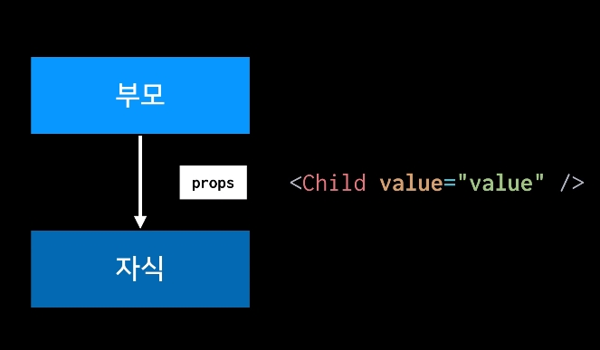
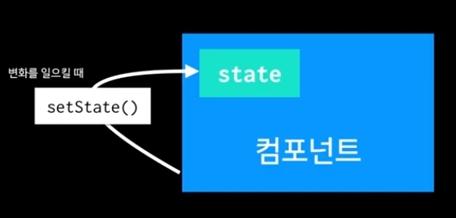
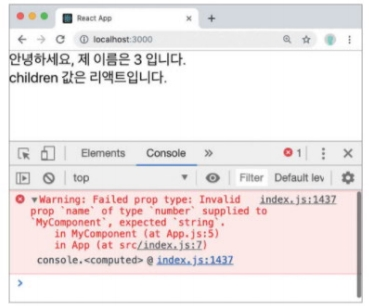
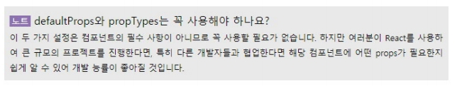

# 1. react를 다루는 기술

## 리액트의 이해
```
[프레임워크 탄생 배경]
JS를 사용하여 HTML로 구성한 UI 제어를 브라우저 DOM Seletor API를 사용해서 이변트 변화를 설정했다.
사용자와의 인터랙션이 별로 없는 웹페이지라면 상관없겠지만, 만약에 인터랙션이 자주 발생하고 이에 따라 동적으로 UI 를 표현해야된다면,
UI를 만들기 위한 JS규칙이 정말 다양해질것이고 그러면 관리하기도 힘들어질 것이다. 그러서 프레임워크가 만들어졌다.

즉,  JS특정 값이 바뀌면 특정 DOM의 속성이 바뀌도록 연결을 하고,  업데이트 하는 작업을 간소화해주는 방식으로 웹 개발의 어려움을 해결해주었다.
```

1. [JS기반 프레임워크의 주된 애플리케이션 구조화]
```
- MVC(Model-View-Controller)아키텍쳐, MVVM(Model-View-View-Model)아키텍쳐
- AngularJS : MVW(Model-View-whatever)아키텍쳐
- MVC, MVVM, MVW의 공통점 :  Model과 View
  - Model : application에서 사용하는 데이터를 관리하는 영역
  - View : 사용자에게 보이는 부분
- 순회 구조 : 프로그램이 사용자에게 입력 받기 -> 컨트롤러는 모델 데이터를 조회하거나 수정 -> View 반영 (뷰 변형(mutate))
```
▼ :smirk: 리액트는 ? `오직 V(View)만 신경 쓰는 라이브러리`
```tip
데이터가 변할 때마다 변화를 줄지에 대한 고민이 아닌, 기존의 View를 날려버리고 새로 처음부터 렌더링하는 방식을 생각하게 되었다.
```

2. [컴포넌트?]
  - 리액트 프로젝트에서 특정 부분이 어떻게 생길지 정하는 선언체
  - `!=` 다른 프레임워크에서 UI를 다룰 때 사용하는 템플릿과는 다른 개념이다.
  - 컴포넌트는 재사용이 가능한 API로 수많은 기능들을 내장하고 있으며, 컴포넌트 하나에서 생김새와 작동 방식을 정의한다.
  ```javascript
  const Hello = ({ name }) => <div>Hello, {name}</div>
  ```

3. [초기 렌더링?]
- 렌더링 : 사용자 화면에 뷰를 보여 주는 것
```
render(){ ... }
```
- 렌더 함수는 컴포넌트가 어떻게 생겼는지 정의하는 역할을 한다.
- html형식의 문자열의 반환이 아닌, `view의 생김새와 작동방식에 대한 정보를 지닌 객체를 반환`한다.
  - 컴포넌트 내부에는 또 다른 컴포넌트들이 들어갈 수 있다.
- 최상위 컴포넌트의 렌더링이 끝나면 지니고 있는 정보들을 사용하여 HTML마크업을 만든다.
  - 이를 실제 페이지의 DOM 요소 안에 주입한다.

4. [조화 과정]
- 리엑트에서 VIEW를 업데이트 할 때는 `Reconciliation (조화과정) 을 거친다` 라고 한다.
- 컴포넌트에서 데이터 변화가 있을 때
  - 우리의 눈 : 변화에 따라 view가 변형
  - 실제 : 새로운 요소로 갈아끼움
- component는 데이터 업데이트 시 단순 데이터 값 수정이 아닌, 새로운 데이터로 render함수 또 다시 호출한다.
- render함수가 만들었던 컴포넌트 정보와 현재 render 함수가 만든 컴포넌트 정보를 비교한다.


## 리액트의 특징
1. DOM (Document Object Model)이란?
  - 객체로 문서 구조를 표현하는 방법으로 xml이나 html로 작성한다.
  - 브라우저의 DOM Selector API 를 사용해서 특정 DOM 을 선택한뒤, 특정 이벤트가 발생하면 변화를 주도록 설정
  - 웹 브라우저는 DOM을 활용하여 객체에 JS와 CSS를 적용한다.
  - 트리 형태라서 특정 노드를 찾거나 수정 할 수 있고, 제거하거나 원하는 곳에 삽입할 수 있다.

   - 1) [DOM의 치명적 단점]
     - 동적 UI에 최적화 되어 있지 않다.

   - 2) [해결 법]
     - Virtual DOM 방식을 사용하여 DOM업데이트를 추상화 시킴 => DOM 처리 획수를 최소화하여 효율적으로 진행한다.


2. [리액트에서는 Virtual DOM 이라는 것을 사용]
  - 리액트는 상태가 업데이트 되면, 업데이트가 필요한 곳의 UI 를 Virtual DOM 을 통해서 렌더링 한다.
  - 그리고 나서 리액트 개발팀이 만든 매우 효율적인 비교 알고리즘을 통하여 실제 브라우저에 보여지고 있는 DOM 과 비교를 한 후, 차이가 있는 곳을 감지하여 이를 실제 DOM 에 패치시켜 준다.
    (이를 통하여, "업데이트를 어떻게 할 지" 에 대한 고민을 하지 않으면서, 빠른 성능도 지켜낼 수 있게 되었습니다.)


3. Virtual DOM
- 실제 DOM에 접근하여 조작하는 것이 아닌, 추상화한 JS객체를 구성하여 사용한다. 실제 DOM과 비슷한 사본이다.
- 웹 브라우저에 실제 DOM을 업데이트 할 때는
  - 1). 데이터를 업데이트 하면 전체 UI를 Virtual DOM에 리렌더링 한다.
  - 2). 이전 Virtual DOM에 있던 내용과 현재 내용을 비교한다.
  - 3). 바뀐 부분만 실제 DOM에 적용한다.


4. 기타
- 리액트는 프레임워크가 아니라 라이브러리이다.
  - 다른 웹프레임워크가 Ajax, 데이터 모델링, 라우팅과 같은 기능을 내장하고 있지만, 리액트는 오로지 `view`만 신경 쓰는 라이브러리이다.
  - 즉, 기타 기능은 직접 구현하여 사용 <br>
  

  ```tip
  [라이브러리 & 프레임워크 차이점]
  라이브러리 : 객체관리를 사용자가 직접 하는 것, 객체를 필요한 곳에서 생성하여 사용한다.
    -  미리 작성된 코드, 함수, 클래스, 값 등을 책장에서 꺼내서 내가 사용하는 것

  프레임워크 : 객체관리를 사용자가 하는 것이 아닌 프레임워크가 Runtime 시점에 해주는 것이다.
  -  당신은 뼈대에 살을 붙이는 것이다. 티라노 화석으로 트리케라톱스를 만들 수 없 듯이 당신은 소프트웨어 프레임 워크가 지정한 구조를 따라야한다.
  ```

- 빈 자리는 해당 분야에서 마음에 드는 라이브러리를 사용하면 된다.
  - 라우팅에는 react-router, Ajax 처리에는 axios나 fetch, 상태 관리는 redux나 MobX등 을 사용 등
- 리액트는 다른 웹 프레임워크나 라이브러리와 혼용할 수 있다.

## 작업환경 설정

- node.js
- yarn : npm을 대채할 수 있는 패키지 관리자 도구, npm보다 효율적인 캐시 시스템과 빠른 속도, 부가기능을 제공한다.


## JSX
### 코드 이해하기
- `JSX는 리액트에서 생김새를 정의할 때 사용하는 문법`이다.
- 얼핏보면 HTML 같이 생겼지만 실제로는 JavaScript

```note
import React from 'react';

이 코드는 리액트를 불러와서 사용할 수 있게 해준다. 프로젝트 생성 과정에서 node_modules 디렉터리에 react모듈이 설치된다. 그리고 이렇게 import 구문을 통해 리액트를 불러와서 사용할 수 있다.

모듈을 불러와서 사용하는 것은 브라우저에 없는 기능!
(브라우저가 아닌 환경에서 자바스크립트를 실행할 수 있게 해 주는 환경 : node.js)
Node.js는 import가 아닌 `require`라는 구문으로 패키지를 불러온다.
```

- **bundler** : bundle(묶다). 파일을 연결하는 것
  - 대표적 번들러 : webpack, parcel, brow serify
  - 번들러 도구를 사용하면 import( or require )로 모듈을 불러왔을 때 불러온 모듈을 모두 하나로 합쳐 하나의 파일을 생성해준다.
[!bundler](../../assets/img/bundler.jpg)

- webpack
  - 파일을 불러오는 것 : loader
  - [loader의 종류]
    - css-loader: CSS 파일 불러옴
    - file-loader: 웹 폰트나 미디어 파일을 불러옴
    - babel-loader: 자바스크립트 파일을 불러오면서 babel을 이용해 ES5로 변환

```tip
최신 자바스크립트를 왜 ES5로 변환할까?
구버전 웹 브라우저와 호환하기 위해서 이고, JSX라는 문법 또한 정식 자바스크립트 문법이 아니므로 형태 변환 후 사용해야 한다.
```

### JSX란?
- JSX는 XML과 매우 비슷하게 생겼다. 작성 된 코드는 번들링되는 과정에서 바벨을 사용해 일반 자바스크립트 형태의 코드로 변환된다.
```javascript
// JSX
function App(){
  reutrn(
    <div>
      Hello <b>react</b>
    </div>
  )
}
```
▼ JSX에서 JAVASCRIPT로 변환
```javascript
function App(){
  return React.createElement("div", null, "hello", React.createElement("b", null, "react"));
}
```


```javascript
ReactDOM.render(<APP />, document.getElementById('root'));
```

```NOTE
[ReactDOM.render란?]
컴포넌트를 페이지에 렌더링하는 역할을 하며, react-dom 모듈을 불러와 사용할 수 있다.
이 함수의 첫번째 파라미터에는 페이지에 렌더링할 내용을 JSX형태로 작성하고,
두 번째 파라미터에는 해당 JSX를 렌더링할 document 내부 요소를 결정한다. (id가 'root'인 요소 안에 렌더링하도록 설정)
```


### JSX 사용법
```tip
JSX는 괄호로 감싸야 하나요?
(<div>Hello World</div>)와 같이 감쌀 때도 있고 감싸지 않을 때도 있다.
주로 JSX 여러줄로 작성할 때 괄호로 감싸고, 한 줄로 표현되면 JSX는 감싸지 않는다.
필수사항은 아니다.
```

### 1. [꼭 닫혀야 하는 태그]
- 태그를 열었으면 꼭, `<div></div>`이렇게 닫아주어야 한다.
- 닫히는 없는 태그는 꼭 `SELF CLOSING 태그`를 사용한다.
  ```
  HTML 에서는 input 또는 br 태그를 사용 할 때 닫지 않고 사용하기도 하지만 리액트에서는 절대 X
  태그와 태그 사이에 내용이 들어가지 않을 때에는, Self Closing 태그 라는 것을 사용`해야 한다.
  Self Closing 태그를 사용해주었는데요, 열리고, 바로 닫히는 태그를 의미한다.
  ```

### 2. [꼭 감싸져야하는 태그]
- 컴포넌트에 여러 요소가 있다면 반드시 부모 요소 하나로 감싸야 한다.
- `불필요한 <div></div>`에는 `fragment(<></>)`를 사용한다.
```
[이유?]
virtual DOM에서 컴포넌트 변화를 감지해 낼 때 효율적으로 비교할 수 있도록
컴포넌트 내부는 하나의 DOM트리 구조로 이루어져야 한다는 규칙이 있기 때문
```

```javascript
function App() {
  return (
    <Hello />
    <div>안녕히계세요.</div>
  );
}
```
▼ 두개 이상 코드 감싸기
```javascript
function App() {
  return (
    <div>
      <Hello />
      <div>안녕히계세요.</div>
    </div>
  );
}
```
▼ 불필요한 div 빼기 - 그럴 땐, 리액트의 Fragment 라는 것을 사용
```javascript
function App() {
  return (
    <>
      <Hello />
      <div>안녕히계세요</div>
    </>
  );
}
```

- [Fragment]
  - `<>내용</>`의 형태
  - Fragment 는 브라우저 상에서 따로 별도의 엘리먼트로 나타나지 않는다.
  - [!fragment](../../assets/img/fragment.jpg)


### 3. JSX 안에 자바스크립트 값 사용하기

#### 자바스크립트 표현식 `{}`
- JSX 내부에 자바스크립트 표현식을 쓸 수 있다.
- javascript 표현식을 작성하려면 JSX 내부 코드를 `{}` 으로 감싸서 보여준다.

```javascript
import React from 'react';
import './App.css';

function App() {
  const name = '리액트';
  return (
    <>
    <h1>{name} 안녕!</h1>
    <h2>잘 동작하니</h2>
    </>
  );
}

export default App;
```

```tip
var키워드는 scope (해당 값을 사용할 수 있는 코드 영역) 가 함수영역이다.
let은 동적인 값을 담을 수 있는 변수를 선언할 때 사용하는 키워드.
const는 한번 선언하면 재설정 할 수 없다.
```
[!let_bar](../../assets/img/let_var.jpg)

#### if문 대신 삼항연산자
- 조건에 따라 렌더링 해야하는 상황 - `JSX 내부에서는 if문을 사용할 수 없다.`
- 방법 1: JSX밖에서 if문을 사용하여 사전에 값을 설정
- 방법 2: {}안에 조건부 연산자 사용 =>
```javascript
function App() {
  const name = '리액트';
  return (
    <>
    {name === '리액트' ? (<h1>이것은 리액트 입니다.</h1>):(<h2>리액트가 아닙니다.</h2>)}
    </>
  );
} //이것은 리액트 입니다.
```


####  연산자를 사용한 조건부 렌더링
```
AND연산자(&&) : 두 조건 모두 참인 경우 참
OR 연산자(||) : 두 조건 중 하나 참인 경우 참
```

[**삼항연산자와 &&연산자의 적합성**]
```tip
[어떤 상황에서 삼항연산자와 &&연산자를 쓰는지?]
보통 삼항연산자는 참과 거짓에 따라 내용이 달라져야 할 때 사용하는데,
참인지 거짓인지에 따라 값을 숨기거나 보여주거나 할때는 &&연산자 사용한다.
```

```js
function App(isSpecial) {
  const name = '리액트';
  return (
    <>{isSpecial ? '스페셜하다' : '낫스페셜'}</>
  );
}
```
  - 값에 따라 보여줘야 할 값이 아예 다를 경우 :  `삼항연산자` 사용

```js
function App(isSpecial) {
  const name = '리액트';
  return (
    <>{isSpecial && <b>*</b></>
  );
}
```
  - 단순 값을 보여주거나 숨길 때 :  `&&연산자` 사용


##### AND(&&)연산자 조건부 렌더링
- 개발시 특정 조건을 만족할 때 내용을 보여주고, 만족하지 않을 때 아예 아무것도 렌더링 하지 않아야 하는 상황
- &&연산자로 조건부 렌더링이 가능한 이유?
  - 리액트에서 false를 렌더링할 때는 null과 마찬가지로 아무것도 나타나지 않기 때문.
  - `falsy한 값은 0은 예외적으로 화면에 나타난다는 점은 주의`
- false값은 아무것도 나타나지 않고, true일 경우 && 뒤 문장 출력한다. (하지만 falsy값은 예외적으로 화면에 출력된다.)

```js
function App() {
  const name = '리액트';
  return (
    <>{name === '리액트' ? <h1>이것은 리액트 입니다.</h1> : null}</>
  );
} //이것은 리액트 입니다.
```
▼ 더 짧은 코드
```js
function App() {
  const name = '리액트';
  return (
    <>{name === '리액트' && <h1>이것은 리액트 입니다.</h1>}</>
  );
} //이것은 리액트 입니다.
```


##### OR(||)연산자 조건부 렌더링
[undefined를 렌더링하지 않기]
- 리액트 컴포넌트 함수에서 undefined만 반환하여 렌더링하는 상황을 만들면 안된다.
  - 이렇게 사용하면 안됨 X
    ```js
    function App() {
      const name = undefined;
      return name;
    } //app(...) error발생
    ```

```js
function App() {
  const name = undefined;
  return name || '값이 undefined입니다.';
} //값이 undefined입니다.
```
- 어떤 값이 undefined일 수도 있다면, OR`(||)`연산자를 사용해 해당 값이 undefined일 때 사용할 값을 지정할 수 있으므로 간단하게 오류를 방지 할 수 있다.

```js
import React from 'react';
import './App.css';

function App() {
  const name = undefined;
  return <div>{name || '값이 undefined입니다.'}</div>;
}

export default App;
```
- 반면 JSX내부에서 undefined를 렌더링 하는 것은 괜찮다.
- name값이 undefined일 때 보여주고 싶은 문구가 있다면 이런식으로 작성하면 된다.


## import 중괄호{}의 의미
```
import React, { Component } from 'react';
```
▼ 중괄호가 없을 때의 표현
```
import React from 'react';
const Component = React.Component;
```


## style 과 className
1. 인라인 스타일
- DOM요소에 스타일을 적용할 때 방법
  - 1). 객체 형태로 넣어주기
  - 2). 스타일 중 '-' Bar가 포함되어 있는 이름은 카멜표기법으로 작성한다.

- [객체를 미리 선언하지 않고 바로 style값을 지정할 때]
```javascript
  function App() {
    const name = 'react';
    const style = {
      backgroundColor: 'black',
      color: 'aqua',
      fontSize: 24, // 기본 단위 px
      padding: '1rem' // 다른 단위 사용 시 문자열로 설정
    }

    return (
      <>
        <Hello />
        <div style={style}>{name}</div>
      </>
    );
  }

  export default App;
```

2. class대신 className
- JSX에서는 class가 아닌 className으로 설정해 주어야 한다.
- class로 설정해도 스타일이 적용되지만, console탭에서 경고가 확인된다.
```js
  return <div>
    {name || '값이 undefined입니다.'}
    <div className="gray-box"></div>
  </div>;
```

3. 주석 사용법
- JSX 내부의 주석은 {/* 이런 형태로 */} 작성
- 추가적으로, 열리는 태그 내부에서는 // 이런 형태로도 주석 작성이 가능하다.
```note
{/* 주석은 화면에 보이지 않습니다 */}
//  주석은 화면에 보이지 않습니다
/* 중괄호로 감싸지 않으면 화면에 보입니다 */
```

## Component
- 하나의 페이지를 구현하기 위해 여러 개의 컴포넌트를 사용한다. 그렇기에 컴포넌트의 기능은 단순한 템플릿 이상이다.
1. 데이터가 주어졌을 때, 이에 맞추어 UI를 만들어준다.
2. 라이프사이클 API를 이용하여 컴포넌트가 화면에서 나타날 때, 사라질 때, 변화가 일어날 때, 주어진 작업들을 처리할 수 있다.
3. 임의 메서드를 만들어 특별한 기능을 부여할 수 있다.


[App 함수형 컴포넌트]
   - 초기 마운트 속도와 불필요한 기능이 없기 때문에 메모리를 덜 사용한다.
   - 단순히 props만 받아와서 보여주는 경우에 주로 사용한다. (딱히 기능이 아닌 그대로 보여주는 경우)
```javascript
import React from 'react';

static defaultProps = {
  name : '기본이름'
}

 const MyName = {{ name }} => {
  return <div>저의 이름은 {name} 입니다.</div>;
 }

export default App;
```

[App 클래스형 컴포넌트]
```javascript
import React, {Component} from 'react';

class App extends Component{
  render(){
    const name = 'react';
    return<div className="gray-box">{name}</div>
  }
}

export default App;
```

**자바스크립트 CLASS문법 알아가기**
- [ES6이전 함수형 prototype 문법 사용]
```javascript
  function Dog(name){
      this.name = name;
  }

  Dog.prototype.say = function(foo){
      console.log(this.name + foo);
  }

  const dog = new Dog('검둥이');
  dog.say('왈왈'); //검둥이왈왈
  ```
  ▼
- [ES6 Class문법]
```javascript
  class Dog{
      constructor(name){
          this.name = name;
      }
      say(foo){
          console.log(this.name + foo);
      }
  }

  const dog = new Dog('흰둥이');
  dog.say('왈왈');
```

### 컴포넌트 생성

#### 클래스형 컴포넌트 & 함수형 컴포넌트

- props를 사용할 때는 render함수에서 this.props를 조회한다.
- defaultProps와 propTypes의 설정방식은 동일하다.

#### [props]

- React.js에서 props는 Immutable Data 즉, 변하지 않는 데이터
- **우리가 어떠한 값을 컴포넌트에게 전달해줘야 할 때, props 를 사용한다.**
- properties를 줄인 표현으로 `속성설정` 할때 사용하는 요소이다.
- 해당 컴포넌트를 불러와 사용하는 부모 컴포넌트에서 다시 설정할 수 있다.
- props 값은 함수의 파라미터로 받아 와서 사용할 수 있다.
- jsx내부에서 `{}`기호로 감싸 주면 된다.

(component를 만들면 불러와서 사용하게됨)
- 컴포넌트에 어떠한 값을 렌더링 해주고 싶을 때 사용 (이 과정에서 값을 넣어주는 것을 props라고 한다.)

- [props 사용방법]
  - `<컴포넌트이름 props이름 = “값”>`
  - 상위 컴포넌트에서 HTML의 attribute를 정의하듯, 하위 컴포넌트의 속성처럼 사용한다.
  - props를 정의하면 하위 컴포넌트에서 `{this.props.props}` 이름으로 사용할 수 있다.
    - 함수형 컴포넌트라면 {props파라미터.props이름}


#### [state]

- 컴포넌트 내부에서 바뀔 수 있는 값을 의미한다.
- 값이 바뀔 때 마다 Component는 리렌더링이 된다.
  - 변경 할 때는 언제나 `setState`라는 내장함수를 사용한다.

```
props는 컴포넌트가 사용되는 과정에서 부모 컴포넌트가 설정하는 값
컴포넌트 자신은 해당 props를 읽기 전용으로만 사용할 수 있다.
-> props를 바꾸려면 부모 컴포넌트에서 바꾸어 주어야 한다.

  [App 클래스형 컴포넌트]
  import React, {Component} from 'react';
  import MyComponent, from './MyComponenet';
  class App extends Component{
    render(){
      const name = 'react';
      return<div className="gray-box">{name}</div>
    }
  }

  export default App;

ex) App컴포넌트에서 MyComponent를 사용할 때 props를 바꾸어 주어야 값이 변경될 수 있는 것
반면, MyComponent에서 전달받은 name값을 직접 바꿀 수 없다.
```


##### 컴포넌트 사용시, props값 지정
```js
  <!-- APP.js -->
  import React from 'react';

  const MyComponent = () => {
    return <div>안녕하세요. 제이름은 {props.name} 입니다.</div>
  };

  export default MyComponent;
```

##### props 기본값 설정 : defaultProps
```js
  <!-- MyComponent.js -->
  import React from 'react';

  const MyComponent = props => {
    return <div>안녕하세요. 제이름은 {props.name} 입니다.</div>
  };

  MyComponent.defaultProps = {
      name : '기본이름 : 이다빈'
  };
  export default MyComponent;
```
▼[최신 버전 ]

```js
  <!-- MyComponent.js -->
import React, { Component } from "react";

class MyName extends Component {
  static defaultProps = {
    name: "기본이름"
  };

  render() {
    return (
      <div>
        안녕하세요! 제 이름은 <b>{this.props.name}</b>입니다.
      </div>
    );
  }
}

export default MyName;
```


##### 태그 사이의 내용을 보여주는 children
```js
  <!-- APP.js -->
  import React from 'react';
  import myComponent from './MyComponent.js';

  const App = () => {
    return <MyComponent>리액트</MyComponent>
  };

  export default App;
```
- 태그사이 작성 문자열을 MyComponent 내부에서 보여 주려면 props.children값을 보여주어야 한다.

```js
  <!-- MyComponent.js -->
  import React from 'react';

  const MyComponent = props => {
    return <div>안녕하세요. 제이름은 {props.name} 입니다. <br />
            children 값은 {props.children}입니다.</div>
  };

  MyComponent.defaultProps = {
      name : '기본이름'
  };
  export default MyComponent;
```

- 결과
```
  안녕하세요. 제이름은 기본이름 입니다.
  children 값은 리액트입니다.
```


##### 비구조화 할당 문법을 통해 props 내부 값 추출
- 객체에서 값을 추출하는 문법 비구조화 할당 (destructuring assignment)라고 한다.
- 구조 분해 문법이라고 불리며, 함수의 파라미터 부분에서도 사용할 수 있다.
  - 함수의 파라미터가 객체라면, 그 값을 바로 비구조화해서 사용하는 것

```javascript
  <!-- MyComponent.js -->
  import React from 'react';

  const MyComponent = props => {
  const {name, children} = props;
  return <div>
      안녕하세요. 제이름은 {name}입니다.
      children값은 {children}입니다.
      </div>
  };

  MyComponent.defaultProps = {
      name : '기본이름'
  };
  export default MyComponent;

  // 안녕하세요. 제이름은 기본이름입니다. children값은 리액트입니다.
```

▼

```javascript
  <!-- MyComponent.js -->
  import React from 'react';

  const MyComponent = ({name, children}) => {
  return <div>
      안녕하세요. 제이름은 {name}입니다.
      children값은 {children}입니다.
      </div>
  };

  MyComponent.defaultProps = {
      name : '기본이름'
  };
  export default MyComponent;

  // 안녕하세요. 제이름은 기본이름입니다. children값은 리액트입니다.
```

1. propTypes를 통한 props 검증
- :one: 컴포넌트의 `필수 props를 지정`하거나 `props의 타입을 지정`할 때 쓴다.
  - 1) 상단에 import구문을 불러와야 한다.
  ```js
  <!-- MyComponent.js -->
  import React from 'react';
  import PropTypes from 'prop-types';
  ...
  ```
  - 2) 기본이름을 설정할 때 처럼 하단에도 코드를 넣는다.
  - 이렇게 하면 name은 무조건 문자열 형태로 전달해야 한다는 것을 의미한다.
  ```
  MyComponent.propTypes = {
      name : PropTypes.string
  };
  ```
  - 3) App.js로 들어가서 name설정해보기

  ```js
  <!-- App.js -->
  import React from 'react';
  import MyComponent from './MyComponent';

  const App = () => {
    return <MyComponent name={3}>리액트</MyComponent>
  };

  export default App;
  //안녕하세요. 제이름은 3입니다. children값은 리액트입니다.
  ```

  ▼

  ```
  <!-- 오류가 뜨지 않음. -->
  return <MyComponent name="react">리액트</MyComponent>
  ```



- :two: isRequired를 사용하여 필수 propTypes 설정
  - propTypes를 지정하지 않았을 때 띄워지는 경고 창 작업
  - porpTypes를 지정할 때 뒤에 isRequired를 붙여 주면 된다.

```javascript
  <!-- MyComponent.js -->
  import React from 'react';
  import PropTypes from 'prop-types';

  const MyComponent = ({name, favoritNumber, children}) => {
  return <div>
      안녕하세요. 제이름은 {name}입니다.
      children값은 {children}입니다.<br />
      제가 제일 좋아하는 숫자는 {favoritNumber} 입니다.
      </div>
  };

  MyComponent.defaultProps = {
      name : '기본이름'
  };

  MyComponent.propTypes = {
      name : PropTypes.string,
      favoritNumber: PropTypes.number.isRequired
  };

  export default MyComponent;
  ```

  ```js
  <!-- App.js -->
  import React from 'react';
  import MyComponent from './MyComponent';

  const App = () => {
    return <MyComponent name="react" favoritNumber= {3}>리액트</MyComponent>
  };

  export default App;
```


- :three: 더 많은 Proptypes 종류
  - array
  - arrayOf( 다른 propType )  : 특정 propType으로 이루어진 배열을 의미한다.
    - ex) arrayOf(PropTypes.Number)는 숫자로 이루어진 배열이다.

  - bool : true or false
  - func : 함수
  - number : 숫자
  - object : 객체
  - string : 문자열
  - symbol : ES6의 Symbol
  - node : 렌더링할 수 있는 모든 것
    - (number, string, JSX코드 ...)




##### 1. 클래스형 컴포넌트 state
- 클래스형 컴포넌트는 잘 쓰지 않음.

```javascript
import React, { Component } from 'react';

class Content extends Component {
    state = {
        // state는 객체여야 한다.
        number: 0
    }

    constructor(props){// 컴포넌트가 만들어질 때마다 호출되는 함수
        super(props); // component가 갖고 있는 생성함수를 호출해줘야 한다.
        this.state = {
            number: 0
        };
    }


    // state값의 변화를 주기위해서 costom method를 만들어야 한다 .gray-box
    handleIncrease = () => {
        this.setState({
            number : this.state.number + 1
        })
    }

    handleDecrease = () => {
        this.setState({
            number : this.state.number - 1
        })
    }

    render(){
        const { number } = this.state; //state를 조회할때는 this.state로 조화한다.
        return(
            <div>
                <h1>카운터</h1>
                <div>값 : {this.state.number}</div> {/* state사용 */}
                <button onClick={this.handleIncrease}>+</button>
                <button onClick={this.handleDecrease}>-</button>
                {/* 버튼이 눌릴때 마다 컴포넌트는 리렌더를 해줘야한다. / onClick을 통해 버튼이 클릭되었을 때 호출할 함수를 지정한다. */}
            </div>
        )
    }
}

export default Content;
```
[클래스 컴포넌트 state 만들기 순서]
1. Component가 실행될 때 constructor가 있다면 해당 문장이 가장 먼저 실행되고, 초기화를 담당한다.
```js
class App extends Component {
  constructor(props){ // 1. 컴포넌트가 만들어질 때마다 호출되는 함수
    super(props); // 2. component가 갖고 있는 생성함수를 호출해줘야 한다.
  }
  render(){ ... }
}
```
- 컴포넌트 생성자 메서드
   - Component에 state설정할 때는 `Constructor`메서드를 작성하여 설정한다.
   - 반드시 super(props)를 호출해 주어야 한다.
   - 함수호출이 완료되면 현재 클래스형 컴포넌트가 상속하고 있는 component가 지닌 생성자 함수를 호출해 준다.


1. 초기화가 끝나면 state값을 초기화 시킨다.
```js
class App extends Component {
  constructor(props){
    super(props);
    this.state = { // 3. state값 초기화 - state는 객체 형식
      subject: {title: 'WEB' , sub : 'world wid web'}
    }
  }
  render(){ ... }
}
```
- `this.state` 값에 초깃값을 설정해준다.
   - state는 객체 형식이어야 한다.


3. render함수
```javascript
render(){
   const { number } = this.state; //state를 조회할때는 this.state로 조화한다.
   return(
       <div>
           <h1>카운터</h1>
           <div>값 : {this.state.number}</div> {/* state사용 */}
           {/* 버튼이 눌릴때 마다 컴포넌트는 리렌더를 해줘야한다.
             onClick을 통해 버튼이 클릭되었을 때 호출할 함수를 지정한다. */}
             <button
               onClick = {() => {
                 this.setState({ number: number + 1});
                 // setstate로 새로운 값을 넣을 수 있다.
               }}>

             </button>
       </div>
   )
}
```
   - 현재 state 조회는 this.state를 사용한다.
   - button안에 onClick이라는 값을 props로 주었다. (이벤트 설정(onClick))
   - 이벤트 설정시에는 화살표 함수를 넣어줘야 한다.


**★[이벤트로 설정할 함수를 넣어 줄 때는 화살 함수를 사용하자.]★**
  ```tip
  일반함수로 사용할 경우 함수 내부에 this가 무엇인지 모르게 된다.
  this는 undefined로 나타나게 됨.
  일반함수로 쓸 경우엔 컴포넌트가 만들어질때마다 호출되는 함수 (생성함수)에서 쓰이는 this인것을 먼저
  증명해주고 나서 bind를 해줘야 하기 때문에 코드도 길어지고 재사용성도 떨어진다.
  ```

##### 2. 함수형 컴포넌트 state
- 클래스형 컴포넌트는 꼭 필요할때만 사용할 수 있도록, 최신형은 함수형 컴포넌트를 사용한다.
```javascript
import React from 'react';

function App() {
  const name = '리액트';
  return <div>{name}</div>;
}

export default App;
```

- this.setState에 객체 대신 함수 인자 전달하기
-


### 컴포넌트 차이점
[출처](https://devowen.com/298)

**[클래스형 컴포넌트와 함수형 컴포넌트의 역할은 동일하지만, 몇가지 차이점]**
- class 컴포넌트
  - state기능 및 라이프사이클 기능을 사용할 수 있다.
  - 임이의 메서드를 정의할 수 있다.
  - render함수가 꼭 있어야 하고 그안에서 JSX를 반환해야 한다.
  - 과거의 proptotype을 이용해서 구현하던 es6문법 부터는 class문법을 사용하여 구현할 수 있다.

- 함수형 컴포넌트
  - 클래스형 컴포넌트보다 선언하기가 좀 더 편하고, 메모리 자원을 덜 사용한다는 장점
  - 함수형 컴포넌트에서 state와 라이프사이클 API를 사용할 수 없다는 단점 - 리액트 훅이 도입되면서 해결됨
  - 일반함수 선언방식, 화살표 함수 방식이 있다.


```tip
props는 React에서는 사용자가 컴포넌트에 전달해서 보관하길 원하는 데이터입니다.
즉, 컴포넌트 내에서 데이터가 보관되면, 이 데이터는 수정되지 않고 보존되어야 하는 법칙이 성립됩니다.
만약 props의 값을 변경하고자 할때에는 컴포넌트 내부가 아닌, 부모 컴포넌트에서 이에 대한 부분이 변경되어야 합니다.
```


### constructor() 에서 꺼내기
```javascript
import React, { Component } from 'react';

class Counter extends Component {
    state = {
        number : 0,
        fixedNumber : 0
      };
    }

    render(){
      const { number, fixedNumber } = this.state;
      return (...);
    }
```
- constructor메서드 선언하지 않고 state 초깃값을 설정할 수 있다.
- 바벨에서 사용하는 방법으로 javascript문법은 아님.


## setState
- props나 state값이 바뀌면 그 컴포넌트의 render함수가 다시 호출된다. render함수가 가지고 있는 하위 컴포넌트들의 각 render함수도 다시 호출된다. 즉, props나 state의 값이 바뀌면서 다시 그려지는 시스템

- 1) constructor안에 state값을 바꾸는 것은 가능하지만, `생성된 후 state값을 바꾸는 방법`은 setSate를 사용한다.
```
this.state.mode = 'welcome' //렌더링이 안됨

this.setState({ // 다시 알려줘서 리렌더링
  mode: 'welcome'
})
```

### this.setState 객체 대신 함수 인자 전달하기
- this.setState함수는 인자로 전달된 객체 안에 들어 있는 값만 바꾸어 준다.
- this.setState를 사용하여 state값을 업데이트할 떄는 상태가 비동기적으로 업데이트 된다.

```javascript
onClick = {()=> {
  this.setState({number: number + 1});
  this.setState({number: this.state.number + 1});
}}
```
- this.setState를 사용할 때 객체 대신에 함수를 인자로 넣어주는 것.


## 이벤트핸들링

### 이벤트 주의사항 (중요!)★
```html
<!-- [html] -->
<button onclick="activateLasers()">
  Activate Lasers
</button>
```
▼

```javascript
// [react]
<button onClick={activateLasers}>
  Activate Lasers
</button>
```

- 1). 이벤트이름은 `카멜 표기법`으로 작성한다.
- 2). JSX를 사용하여 문자열이 아닌 함수로 이벤트 핸들러를 전달한다
  - 자바스크립트 코드를 전달하는 것이 아니라, `함수 형태의 값을 전달`한다.
  - 함수형태의 객체를 전달하는 것
- 3). DOM 요소에만 이벤트 설정
  - 만든 컴포넌트에는 이벤트를 자체적으로 설정할 수 없다.
  - ex) My라는 컴포넌트에 onClick값을 설정하면 My를 클릭할때 dosomething 함수 실행이 아니라, 그냥 이름이 onClick인 props를 My에게 전달해 줄 뿐이다.
  - 하지만 전달받은 props를 컴포넌트 내부의 DOM이벤트로 설정 가능하다.

  ```
  <div onClick = {this.props.onClick}>
  {/*(...)*/}
  </div>
  ```

- 4). React에서는 false를 반환해도 기본 동작을 방지할 수 없다. 반드시 preventDefault를 명시적으로 호출해야한다.

```html
<!-- [html] -->
<a href="#" onclick="console.log('The link was clicked.'); return false">
  Click me
</a>
```
▼

```javascript
// [react]
function ActionLink() {
  function handleClick(e) {
    e.preventDefault();
    console.log('The link was clicked.');
  }

  return (
    <a href="#" onClick={handleClick}>
      Click me
    </a>
  );
}
```
- 여기서 e는 합성 이벤트이다.
- [래핑된 이벤트(`SyntheticEvent`)] = S급 짝퉁
  - 순수 자바스크립트에서 HTML이벤트를 다룰 때와 똑같이 사용하면 된다.
  - native event가 아니라 래핑된 이벤트(SyntheticEvent)를 사용 하게 되는데, 이것은 우리가 흔히 사용하는 stopPropagation 과 preventDefault 를 포함하여 브라우저의 기본 이벤트(nativeEvent)와 동일한 인터페이스를 가지고 있다.
  - 단, 네이티브 이벤트와 달리 이벤트가 끝나고 나면 이벤트가 초기화 된다. 정보를 참조할 수 없음.
    - 비동기적으로 이벤트 객체를 참조할 일이 있다면 e.persist()함수를 호출해주어야 한다.
```tip
이벤트 핸들러는 모든 브라우저에서 이벤트를 동일하게 처리하기 위한 이벤트 래퍼 SyntheticEvent 객체를 전달받습니다.
[출처](https://ko.reactjs.org/docs/events.html)
```

1) state에 input값 담기 -
  순서 1. constructor에서 state초깃값 설정
  순서 2. 이벤트 내부에서 this.setState 메서드 호출로 state업데이트 해보기
  순서 3. input의 value값을 state에 있는 값으로 설정하기.


2) 콘솔에 기록되는 e
  - e객체는 래핑이벤트이다. 웹브라우저의 네이티브 이벤트를 감싼다.

### 이벤트 종류
> Clipboard <br>
> Composition<br>
> Keyboard<br>
> Focus<br>
> Form<br>
> Mouse<br>
> Selection<br>
> Touch<br>
> UI<br>
> Wheel<br>
> Media<br>
> Image<br>
> Animation<br>
> Transition


### 메서드 만들기

- `이벤트에 실행할 자바스크립트 코드를 전달하는 것이 아니라, 함수 형태의 값을 전달한다.`
  - 이벤트 처리 시, 렌더링 동시에 함수를 만들어서 전달해 주었다.
  - 함수를 미리 만들어서 전달하는 방법도 있다.

- [기본방식과 화살표함수 방식]
- 기본방식 : this와 바인딩작업이 필요
  - 함수가 호출될 때 this는 호출부에 따라 결정되므로, 클래스의 임의 메서드가 특정 html요소의 이벤트로 등록되는 과정에서 메서드와 this의 관계가 끊어져 버린다. 그래서 임의 메서드가 이벤트로 등록되어도 this를 컴포넌트 자신으로 제대로 가리키기 위해서는 메서드를 this와 바인딩하는 작업이 필요하다.
- 만일 바인딩하지 않으면 this가 undefined를 가리키게 된다.

```javascript
    state={
        message: ''
    }

    constructor(props){
        super(props)
            this.handleChange = this.handleChange.bind(this);
    }
    handleChange(e){
        this.setState({
            message : e.target.value
        });
    }
    render() {
        return (
            <div>
                <h1>이벤트연습</h1>
                <input
                  type="text"
                  name="message"
                  placeholder="입력하세요"
                  valeu={this.state.message}
                  onChange={this.handleChange}/>
            </div>
        )
    }
}
```
▼

- property initializer syntax 사용한 메서드 작성

```javascript
    state={
        message: ''
    }
    handleChange = (e) => {
        this.setState({
            message : e.target.value
        });
    }
    render() {
        return (
            <div>
                <h1>이벤트연습</h1>
                <input
                type="text"
                name="message"
                placeholder="입력하세요"
                valeu={this.state.message}
                onChange={this.handleChange}/>
            </div>
        )
    }
}
```

```danger
 ★리액트에서 이벤트를 설정하는 함수를 넣어줄 때는 반드시 화살표 함수 문법을 사용해야 한다.★
 그리고 이벤트 안에서 this.setState 함수를 사용하고 이 함수는 state의 값을 바꿀 수 있게 해준다.
```

### useState 를 통해 컴포넌트에서 바뀌는 값 관리하기

```javascript

//  1. 컴포넌트 생성
import React, { useState } from 'react'

function Counter2(){
    const onIncrease = () => { //2. 해당 UI의 작동함수 생성
        console.log('+1');
    }
    const onDecreasee = () => { //2. 해당 UI의 작동함수 생성
        console.log('-1');
    }
    return(
        <div>
            <h1>0</h1>
            <button onClick={onIncrease}>+1</button> // 3.동작 작동시 실행시켜 주고 싶은 함수연결
            <button onClick={onDecreasee}>-1</button> // 3.동작 작동시 실행시켜 주고 싶은 함수연결
        </div>
    )
}
export default Counter2;
```
:anger:[주의]:anger:
- 이벤트 호출 시 주의사항 : 함수를 넣어주는 것이기 때문에 호출을 하는게 아님을 주의
  - 호출을 하게 되면 클릭을 하기 전에 렌더링이 되면서 클릭 전 부터 바로 호출이 된다.

```
<button onClick={onIncrease()}>+1</button> X
<button onClick={onDecreasee}>-1</button> O
```


#### useState 동적 상태 띄우기
```
const [number, setNumber] = useState(0);
```
- 배열 비구조화 할당을 통해서 코드를 간편하게 작성할 수 있다.
  - -> useState 함수를 불러와줌
  - -> number라는 상태를 만듬 / `useState(0);` 이상태의 기본값은 0 으로 한다.
  - -> setNumber는 현재 상태 업데이트 하는 함수 (setNumber로 `useState(0);`의 상태값을 바꿔주는 함수이다.)

```javascript
import React from 'react'

function Counter2(){
    const onIncrease = () => {
        console.log('+1');
    }
    const onDecreasee = () => {
        console.log('-1');
    }
    return(
        <div>
            <h1>0</h1>
            <button onClick={onIncrease}>+1</button>
            <button onClick={onDecreasee}>-1</button>
        </div>
    )
}
export default Counter2;
```
▼
```javascript
import React, { useState } from 'react'

function Counter2(){
    const [number, setNumber] = useState(0);
    const onIncrease = () => {
      setNumber(number + 1);
    };
    const onDecreasee = () => {
      setNumber(number - 1);
    };
    return(
        <div>
            <h1>{number}</h1>
            <button onClick={onIncrease}>+1</button>
            <button onClick={onDecreasee}>-1</button>
        </div>
    )
}
export default Counter2;
```

#### useState 통한 함수형 업데이트

```
업데이트 함수 : prevNumber
```

### input 상태 관리하기
- input 의 상태를 관리할 때에는 input 태그의 value 값도 설정해주는 것이 중요하다. 그렇게 해야, 상태가 바뀌었을때 input 의 내용도 업데이트되는 점을 유의할 것

```javascript
import React, { useState } from "react";

function InputSample() {
    // input값을 관리할 상태를 만들어 준다.
    const [text, setText] = useState('');

    const onChange = (e) => {
        setText(e.target.value);
        // console.log(e.target);
    }
    //초기화 값 설정
    const onReset = () => {
        setText('');
    };
    return(
        <div>
            <input onChange = {onChange} value={text}/> {/* value를 넣지 않으면 출력값은 초기화가 되지만, input안의 내용은 초기화가 되지 않는다. */}
            <button onClick={onReset}>초기화</button> {/* value값을 설정해줘야 나중에 초기화 버튼의 인풋을 바꿨을 때도 인풋의 값이 비워지게 된다. */}
            <div>
                <b>값: </b>
                {text} {/* 인풋에서 보여줄 내용 */}
            </div>
        </div>
    );
}

export default InputSample;
```

### input 여러 개 다루기

```javascript
handleChange = (e) => {
    this.setState({
        [e.target.name] : e.target.value
    });
}
```
- event 객체를 활용하여 `e.target.name` 값을 사용하기
- 이벤트 핸들러에서 e.target.name은 해당 인풋의 name을 가리킨다.
- 이 값을 사용하여 state를 설정하면 쉽게 해결할 수 있다.

- 객체안의 key를 []로 감싸면 그 안에 넣은 레퍼런스가 가리키는 실제 값이 key값으로 사용된다.

```javascript
// 예시

const name = 'variantKey';
const object = {
  [name] : 'value'
}
↕ 를 의미한다.
{
  'variantKey' : 'value'
}
```

```
  const onChange = (e) => {
      console.log(e.target.value);
  }
```

- `(e)`?
  - onchange라는 함수 생성
  - 이벤트에 등록하는 함수에는 이벤트 객체 (e)를 받아와서 사용 할 수 있다. 이 객체의 `e.target`은 이벤트가 발생한 DOM인 input DOM을 가리킨다.
  - 이 DOM의 value값 e.target.value를 조회하면 현재 input에 입력한 값이 무엇인지 알 수 있다.


불변성을 지킨다?
- 불변성을 지켜줘야만, 리액트
- 객체상태를 업데이트


## ref: DOM

### ref는 어떤 상황에서 사용해야 할까?
- 일반 HTML에서 DOM요소에 이름을 달 때는 id를 사용한다. HTML에서 id를 사용하여 DOM에 이름을 다는 것처럼 리액트 내부에서 DOM에 이름을 다는 방법은 `ref` (reference의 줄임말) 개념이다. ref는 `DOM을 꼭 직접적으로 건드려야 할 때` 사용한다.
- id를 사용할 수는 있지만, 같은 컴포넌트를 여러번 사용할 경우 유일해야하는 id가 중복이 발생 할 수 있다.
- 리액트에서도 돔을 직접 선택해야하는 상황 예시
  - EX) 특정 elemnet의 크기나 위치를 가지고 와야 하는 상황 / 스크롤바 위치를 가지고 오거나 설정 등등..
- `DOM을 꼭 사용해야하는 상황`
  - state만으로 해결 할 수 없는 기능이 있다.
  - 어쩔 수 없이 DOM에 접근하여 바로 ref를 사용한다.

```
1. 특정 input에 포커스 주기
2. 스크롤 박스 조절하기
3. Canvas요소에 그림 그리기 등
```

### ref 사용법
1. 콜백 함수를 통한 ref 설정
   - props를 설정하는 방법과 유사하며 , ref 값으로 콜백 함수를 전달한다.
```javascript
<input ref={(ref) => {this.input=ref}} />
```

- input은 input 요소의 DOM을 가리킨다.
- ref의 이름은 원하는 것으로 자유롭게 지정한다. (DOM 타입과 상관없이 this.superman=ref 처럼 마음대로)
- ref 사용 종류
  - 1) 클래스형 컴포넌트에서 ref : React.createRef 라는 함수를 사용
    - 리액트에 내장되어 있는 createRef라는 함수 사용
    - createRef를 사용하여 ref를
  - 2) 함수형 컴포넌트에서 ref : useRef 라는 Hook 함수 사용


### 컴포넌트에 ref달기
1) 사용법
  - 컴포넌트 내부에 있는 DOM을 컴포넌트 외부에서 사용할 떄 쓴다.
  - 컴포넌트 ref를 다는 방법은 DOM에 ref를 다는 방법과 똑같다.
```
<MyComponenet
  ref={(ref) => {this.myComponenet=ref}}
/>
```
- ScrollBox 컴포넌트 만들기 -> 컴포넌트에 ref달기 -> ref를 이용하여 컴포넌트 내부 메서드 호출하기


2) 컴포넌트 ref 만들어보기
- scrollTop : 세로 스크롤바 위치 (0 ~350)
- scrollHeight : 스크롤이 있는 박스 안의 div높이 (650)
- clientHeight : 스크롤이 있는 박스의 높이 (300)


## 컴포넌트의 반복

### 자바스크립트 배열의 map()함수
- 코드가 더 늘어난다면 파일용량과 코드의 양은 늘어 날 것이며 보여주어야 할 데이터가 유동적이라면 코드관리에 한계를 느끼게 된다.
- map 함수를 사용해서 반복되는 컴포넌트를 렌더링 할 수 있다.
- map함수는 파라미터로 전달 된 함수를 사용해서 배열 내 각 요소를 원하는 규칙에 따라 변환한 후 그 결과로 새로운 배열을 생성한다.

```javascript
const IterationSample = () => {
    const numbers = [1, 2 , 3, 4, 5];
    const processed = numbers.map(function(num){
        return num + num;
    });
};
```


### 데이터 배열을 컴포넌트 배열로 변환하기
- 문자열로 구성된 배열을 선언한다.
- 배열 값을 이용하여 `<li></li>` JSX코드로 된 배열을 새로 생성한 후 nameList에 담는다.
- map함수에서 JSX작성 시 DOM요소를 작성해도 되고, 아래 코드처럼 컴포넌트를 사용해도 된다.

```javascript
const IterationSample = () => {
    const name = ['눈사람', '얼음', '바람', '비'];
    const nameList = name.map(name => <li>{name}</li>);
    return (
        <ul>
            {/* <li>눈사람</li>
            <li>얼음</li>
            <li>바람</li>
            <li>비</li> */}
            {nameList}
        </ul>
    );
};
```

### key
- 컴포넌트 배열을 렌더링했을 때, 어떤 원소에 변동이 있었는지 알아내려고 사용한다.
- 변화를 더욱 빠르게 알아낼 수 있다.


#### key설정
- 데이터의 고윳값을 key로 설정한다.


```
<div>
    const article = article.map((article) => (
        <Article
            title={article.title}
            title={article.writer}
            title={article.id}
        >
    );
</div>
```


#### key의 역할
- key 의 존재유무에 따른 업데이트 방식
- 배열이 업데이트 될 떄 key 가 없을 때 처럼 비효율적으로 업데이트 하는 것이 아니라, 수정되지 않는 기존의 값은 그대로 두고 원하는 곳에 내용을 삽입하거나 삭제한다.
- 때문에, 배열을 렌더링 할 때에는 고유한 key 값이 있는것이 중요하며, 만약에 배열안에 중복되는 key 가 있을 때에는 렌더링시에 오류메시지가 콘솔에 나타나게 되며, 업데이트가 제대로 이루어지지 않게 된다.

#### key로 사용할 고유값이 없을 경우?
- 만약 배열 안의 원소가 가지고 있는 고유한 값이 없다면 map() 함수를 사용 할 때 설정하는 콜백함수의 두번째 파라미터 index 를 key 로 사용한다.
- 하지만 index를 사용할 경우 고유값을 표기하는 것이 아니라 에러표기가 없어지는 기능 뿐이기에 성능이 좋아지거나 하지 않는다.
```
<div>
    {user.map ((user, index) => (
        <User user={user} key={index} />
    ))}
</div>
```

### 응용

